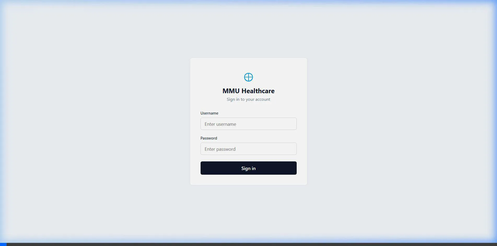
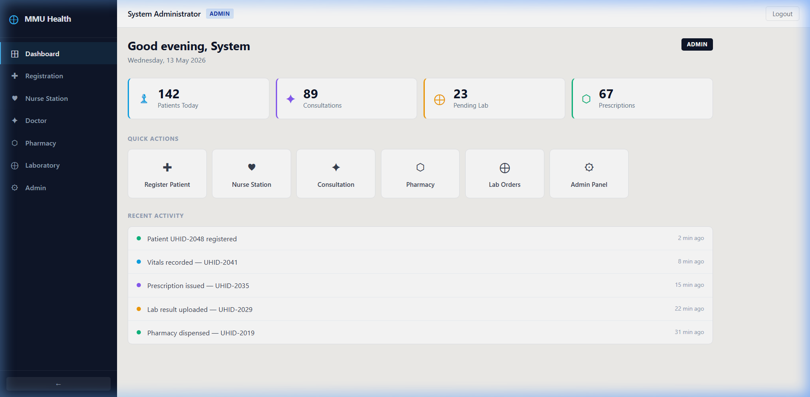

# MMU Healthcare Platform 🏥

[](https://angular.io/)
[](https://tailwindcss.com/)
[](https://opensource.org/licenses/MIT)
[](https://mmu-healthcare-demo.vercel.app)

MMU Healthcare is a comprehensive, enterprise-grade **Standalone Healthcare Management System** built on the cutting edge of **Angular 19**. Designed for high-traffic clinical environments, it offers a seamless, zoneless reactive experience for healthcare professionals.

🚀 **[View Live Demo](https://mmu-healthcare-demo.vercel.app)**

---

## 📺 Interactive Demo

Watch the platform in action, from authentication to patient management:



---

## 🏥 Clinical Workflow

The platform is designed to mirror the actual clinical path of a patient:

1.  **Patient Inflow**: Receptionists register patients and assign them to the Nurse Station queue.
2.  **Initial Screening**: Nurses pull patients from the queue to record vital signs (BP, SpO2, etc.).
3.  **Doctor Consultation**: Doctors access the patient's record, review vitals, and provide diagnosis and e-prescriptions.
4.  **Support Services**: Pharmacists and Lab Technicians receive real-time updates for dispensing and testing.


---

## ✨ Enterprise Features

### 🔐 Secure Multi-Role Access
A robust authentication layer that handles role-based access control (RBAC). The platform dynamically adjusts its UI and permissions based on the logged-in professional's role (Admin, Doctor, Nurse, etc.).

| Role | Access Level | Key Responsibilities |
| :--- | :--- | :--- |
| **Admin** | Superuser | System configuration, user management, and global audits. |
| **Doctor** | Clinical | Consultations, e-prescriptions, and lab order management. |
| **Nurse** | Operational | Patient vitals, queue management, and initial screenings. |
| **Pharmacist** | Support | Medication dispensing and inventory tracking. |

### 📋 Patient Lifecycle Management
From the moment a patient arrives, MMU Healthcare tracks every touchpoint:
- **Registration**: Quick-entry forms with validation.
- **Nurse Station**: Integrated vitals recording (BP, Pulse, SpO2, Temperature).
- **Doctor's Desk**: Comprehensive clinical notes and diagnosis tracking.



### ⚡ Technical Innovation (Angular 19)
- **Zoneless Reactivity**: Utilizing `provideExperimentalZonelessChangeDetection` to eliminate Zone.js overhead, resulting in faster rendering and lower memory footprint.
- **Signal-Driven Architecture**: State management is handled entirely by Angular Signals, providing fine-grained reactivity and eliminating RxJS complexity for simple state.
- **Standalone Components**: 100% standalone architecture for faster builds and easier testing.
- **Tailwind CSS 4.0**: Modern styling with zero runtime overhead and CSS-variable based configuration.

### 🧩 Smart Mock API
The platform includes a built-in **Intercepting Mock Engine**. This allows for a full end-to-end demonstration (Login, Registration, Consultations) without any backend installation, making it perfect for rapid prototyping and stakeholder reviews.

---

## 🛠️ Tech Stack

- **Core**: Angular 19 (Standalone Architecture)
- **State**: Angular Signals & RxJS
- **Styling**: Tailwind CSS 4.0
- **Visualization**: Chart.js / ng2-charts
- **Icons**: Lucide Angular
- **Mocking**: Custom HTTP Interceptors for a "Database-less" full-stack demo.

---

## 📂 Project Structure

```text
mmu-ui/
├── docs/               # Technical documentation & Assets
├── src/
│   ├── app/
│   │   ├── core/       # Global services, guards, and interceptors
│   │   ├── features/   # Domain-specific modules (Admin, Registration, etc.)
│   │   ├── layouts/    # App shell and shared layouts
│   │   └── shared/     # Reusable UI components (Toasts, Buttons, etc.)
│   ├── environments/   # Configuration for Dev/Prod
│   └── styles/         # Global Tailwind & CSS definitions
└── angular.json        # Workspace configuration
```

---

## 🚀 Getting Started

### Prerequisites
- Node.js (v20+)
- Angular CLI

### Quick Setup

1. **Clone & Install**
   ```bash
   git clone https://github.com/SurbhiAgarwal1/MMU.git
   npm install
   ```

2. **Run Locally**
   ```bash
   npm start
   ```
   Access the app at `http://localhost:4200/`.

3. **Explore the Demo**
   Login with:
   - **Username**: `admin`
   - **Password**: `admin`

---

## 📄 License
This project is licensed under the MIT License.

---
*Developed with a focus on modern web standards and healthcare efficiency.*
